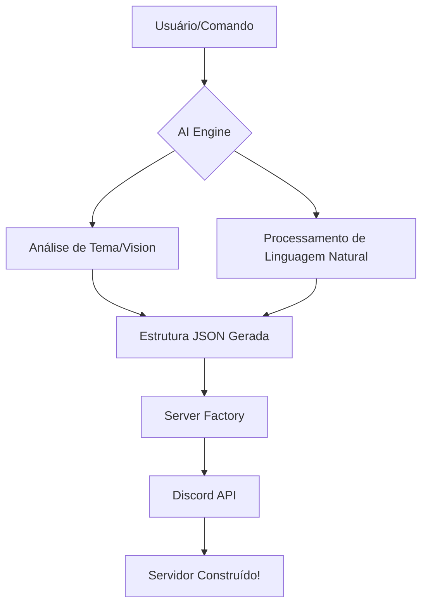

# 🤖 Discord AI Server Agent

<p align="center">
  <strong>O Arquiteto de Comunidades Inteligente</strong><br>
  <em>Transforme suas ideias em infraestruturas complexas no Discord em segundos usando Google Gemini.</em>
</p>

<p align="center">
  
  
  
  
</p>

---

## 🌟 O que é o Discord Agent?

O **Discord AI Server Agent** não é apenas um bot de configuração; é um engenheiro de comunidades autônomo. Ele utiliza o poder do **Gemini 3.1 Pro** para projetar, construir e gerenciar servidores Discord com um nível de imersão e detalhamento sem precedentes.

Desde a criação de nomes narrativos baseados em temas épicos até a clonagem visual de estruturas a partir de capturas de tela, o Agente cuida de toda a "burocracia" de permissões, cargos e canais para você.

---

## ✨ Funcionalidades Principais

| Recurso | Descrição |
| :--- | :--- |
| **🏗️ Geração Temática** | Cria hierarquias de canais e cargos com nomes imersivos e emojis contextuais. |
| **📸 Clonagem Visual** | Analisa prints de servidores via visão computacional para replicar a estrutura original. |
| **🌐 Contexto Web** | Extrai informações de URLs para definir a finalidade e o tom do servidor automaticamente. |
| **📐 Modo Draft** | Gera um rascunho em uma Thread interativa para você ajustar com a IA antes da construção. |
| **🔄 Reconstrução** | Analisa um servidor existente e propõe melhorias de organização e segurança. |
| **🎭 Agente ReAct** | Loop de pensamento (Pensar -> Agir -> Observar) para gerenciar o servidor autonomamente. |

---

## 🛠️ Como funciona? (Arquitetura)



---

## 🚀 Instalação Rápida

### 1. Preparação do Ambiente
Certifique-se de ter o **Python 3.10+** instalado.

```bash
# Clone o repositório
git clone https://github.com/antojunimaia-ui/DiscordAgent.git
cd DiscordAgent

# Instale as dependências
pip install -r requirements.txt
```

### 2. Configuração de Chaves
Crie seu arquivo de ambiente e preencha as credenciais.

```bash
cp .env.example .env
```

> [!IMPORTANT]
> Obtenha o seu token no [Portal de Desenvolvedores do Discord](https://discord.com/developers/applications) e sua chave no [Google AI Studio](https://aistudio.google.com/app/apikey).

---

## 🎮 Comandos do Administrador

Execute `python main.py` e use os comandos abaixo no seu servidor:

*   **`!setup [tema]`**: Inicia a construção imediata do servidor. Você pode anexar uma imagem para clonagem visual!
*   **`!draft [tema]`**: Abre uma Thread interativa para visualizar e editar o rascunho com a IA antes de aplicar.
*   **`!reconstruct`**: A IA estuda seu servidor atual e propõe uma versão "upgrade" mantendo a alma da comunidade.
*   **`!chat [instrução]`**: Ativa o modo Agente Autônomo para tarefas manuais (ex: "Limpe o canal de regras e mude a cor do cargo VIP para dourado").

---

## 🛡️ Segurança e Permissões

O Agente foi treinado para seguir padrões rigorosos de segurança:
- **Overwrites Automáticos**: Canais de Staff são criados automaticamente como privados.
- **Hierarquia Blindada**: Cargos de administração são posicionados corretamente para evitar brechas.
- **Logs de Pensamento**: No modo `!chat`, o bot explica cada passo do seu raciocínio antes de agir.

---

## 📄 Licença

Distribuído sob a licença BSD 3-Clause. Veja `LICENSE` para mais informações.

---

<p align="center">
  Feito com ❤️ por <a href="https://github.com/antojunimaia-ui">Antojunimaia</a>
</p>
